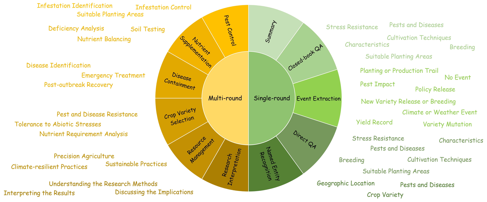

# [NeurIPS2024 Dataset & Benchmark Track] <br> Crop Dataset and Benchmark.

## 👀Introduction

This repository contains the code and data for our paper `Empowering and Assessing the Utility of Large Language Models in Crop Science`. 

We introduce CROP, which includes a novel instruction tuning dataset (Crop dataset) specifically designed to enhance LLMs’ professional capabilities in the crop science sector, along with a benchmark (Crop benchmark) that serves as a comprehensive evaluation of LLMs’ understanding of the domain knowledge. **To the best of our knowledge, Crop dataset is the first-ever instruction tuning dataset in the crop science domain. We anticipate that CROP will accelerate the adoption of LLMs in the domain of crop science, ultimately contributing to global food production.** 

Our project website is https://RenqiChen.github.io/The_Crop/.

## 📚 Dataset



In our work, we propose a instruction fine-tuning dataset for crop science. The dataset will be made publicly available soon (after the paper publication).

### Composition of the Single-round Dialogue Dataset
Please note that despite our data-cleaning efforts, the final QA pairs inevitably contain a small amount of data (<0.5%) from other grains like wheat. Because we think this data does not dominantly influence the fine-tuning results, it is included in the rice and maize QA pairs, and we have listed it separately to avoid any misleading counts.

| Cereal | Type | Task                        | English QA | Chinese QA | Total  |
|--------|------|-----------------------------|------------|------------|--------|
| Rice   | Closed QA | In-domain knowledge QA  | 42951      | 83396      | 126347 |
|        | Open QA   | In-domain knowledge QA  | 2430       | 2037       | 4467       |
|        |           | Event extraction        | 1891       | 1030       |  2921      |
|       |           | Named Entity Recognition| 2003       | 1604       |  3607      |
|        |          | Summary                 | 1586       | 1628       | 3214  |
| Corn   | Closed QA | In-domain knowledge QA  | 25259      | 27667      | 52926  |
|       | Open QA   | In-domain knowledge QA  | 3202       | 3047       | 6249       |
|        |         | Event extraction        | 2245       | 1322       | 3567       |
|       |         | Named Entity Recognition| 2008       | 1316       | 3324       |
|       |          | Summary                 | 1559       | 1857       | 3416  |
| Others*| ---      | ---                      | ---        | ---        | <1000  |
| Overall| ---      | ---                      | 85134      | 124904     | 210038 |

*The 'Others' category includes data from other grains like wheat, which is less than 1000 QA pairs in total.

### Composition of the Multiple-round Dialogue Dataset


| Cereal | Scenario                  | Task                     | English QA                     | Chinese QA                  | Total |
|--------|---------------------------|--------------------------|--------------------------------|-----------------------------|-------|
| Rice   | Problem Solving      | Pest Control              | 14 (3-turn) + 71 (4-turn)     | 8 (3-turn) + 37 (4-turn)    | 130   |
|        |                           | Nutrient Supplementation  | 19 (3-turn) + 93 (4-turn)      | 2 (3-turn) + 90 (4-turn) + 1 (5-turn) | 205   |
|        |                           | Disease Containment       | 19 (3-turn) + 60 (4-turn)      | 4 (3-turn) + 39 (4-turn)    | 122   |
|        | Personalized Recommendation | Crop Variety Selection    | 12 (3-turn) + 53 (4-turn)     | 9 (3-turn) + 9 (4-turn)     | 83    |
|        |                           | Resource Management       | 4 (3-turn) + 110 (4-turn) + 1 (5-turn) | 5 (3-turn) + 50 (4-turn)    | 170   |
|        | Knowledge Interpretation  | Research Interpretation   | 3 (3-turn) + 125 (4-turn) + 1 (5-turn) | 8 (3-turn) + 85 (4-turn)    | 222   |
| Corn   | Problem Solving     | Pest Control              | 20 (3-turn) + 84 (4-turn)     | 7 (3-turn) + 77 (4-turn)    | 188   |
|        |                           | Nutrient Supplementation  | 24 (3-turn) + 56 (4-turn)      | 8 (3-turn) + 30 (4-turn)    | 118   |
|        |                           | Disease Containment       | 21 (3-turn) + 64 (4-turn)      | 2 (3-turn) + 19 (4-turn) + 1 (5-turn) | 107   |
|        | Personalized Recommendation| Crop Variety Selection    | 19 (3-turn) + 75 (4-turn)     | 46 (3-turn) + 47 (4-turn)   | 187   |
|        |                           | Resource Management       | 8 (3-turn) + 94 (4-turn)       | 1 (3-turn) + 69 (4-turn)    | 172   |
|        | Knowledge Interpretation  | Research Interpretation   | 5 (3-turn) + 94 (4-turn) + 1 (5-turn) | 6 (3-turn) + 61 (4-turn)    | 167   |
| Overall| ---                       | ---                      | 1150                           | 721                         | 1871  |

## 💻 Training
### Environment

We tested our codebase with PyTorch 1.13.1 and CUDA 11.6. Please install the corresponding versions of PyTorch and CUDA based on your computational resources.

To install the required packages, run:
```bash
pip install -r requirements.txt.
```

#### Note
flash-attention need linux kernel higher than 5.5

### Setup

We use the [COIG-CQIA](https://github.com/paralym/COIG-CQIA) dataset as an additional general dataset in this work to aviod losing generalization capability, which consists of multi tasks chinese Instruction Fine-tuning

```bash
 --dataset ruozhiba
```

To use Crop data for fine-tuning models, download the Crop datasets to the './train/data' folder and revise the file 'dataset_info.json' file by adding the following annotation to the config file:
```json
  "crop_dataset": {
    "file_name": "crop dataset.json"
  }
```

Then, update the training command:

```bash
--dataset ruozhiba, crop_dataset
```

We recommend downloading the pre-trained model weights to the /train/model folder.
```
cd /train
mkdir model
```
then download a pretraining model:
[LLama3-8B](https://huggingface.co/meta-llama/Meta-Llama-3-8B) ,
[InternLM2-7B](https://huggingface.co/internlm/internlm2-7b) ,
[Qwen1.5-7B](https://huggingface.co/Qwen/Qwen1.5-7B) .

### Usage

To train local models using our dataset with LoRA, run:
```
CUDA_VISIBLE_DEVICES=0 python src/train_bash.py --stage sft --model_name_or_path ./train/model/Meta-Llama-3-8B  --do_train --dataset ruozhiba --finetuning_type lora  --lora_target q_proj,v_proj --output_dir /output --logging_steps 10 --save_steps 100 --num_train_epochs 4 --plot_loss --per_device_train_batch_size=4 --fp16 --template default --preprocessing_num_workers 1
```
This refined version should help you better understand and utilize the project. If you have any questions, feel free to reach out.

## 📈 Benchmark

<p align="center">
    
</p>

In our paper, we introduce a new Crop benchmark for crop cultivation, containing three difficulty levels. The benchmark will be made publicly available soon (after the review of NIPS2024).
| Level    | Count | Proportion |
|----------|-------|------------|
| Easy     | 1613  | 31.97%     |
| Moderate | 2754  | 53.72%     |
| Difficult| 722   | 14.31%     |

### Result of Commercial LLMs

We release the evaluation results of commercial LLMs (GPT-4, GPT-3.5, Claude-3, and Qwen) on Crop benchmark in ./Result/API_result.xlsx.

## :100: Evaluate

### Commercial LLMs

We release our evaluation codes for commercial LLMs in `/evaluate` folder, where `gpt3_benchmark.py` is used for GPT-3.5, `gpt4_benchmark.py` is used for GPT-4, `claude3_benchmark.py` is used for Claude-3-opus, `qianwen_benchmark.py` is used for Qwen-max. `claude3_benchmark_en` is an evaluation code with prompts in English.

Please note to replace the input/output folder path and API key.

### Open-source LLMs

We release an `api.sh` file in /train/src folder for you to easily depoly the open-source LLMs (LLaMA3-8B, Qwen1.5-7B, and InternLM2-7B) at the local host. Then you could call local model for evaluation by running:
```
cd /evaluate
python localmodel_benchmark.py
```
Please note to replace the input/output folder path.

### How to Handle Results

In fact, commercial LLMs could follow the provided prompts to generate formatted results and you can use regular experssions to extract. However, for open-source LLMs, limited by weaker instruction-following abilities, the responses typically do not follow a fixed format. For example, the responses not only include the options but also the content corresponding to those options. In such cases, if we choose to extract options `(A, B, C, D)` from the responses, we will not obtain satisfactory results because there may exist a large number of A, B, C, and D. 

Therefore, when statistically analyzing the results of open-source LLMs, we replace the options in the questions with Roman numerals `(I, II, III, IV)` to ensure uniqueness when extracting with regular expressions, and then calculate the accuracy of the models. Here we show an example:
```
This is a multiple-choice question about agriculture. As an agricultural expert, you should answer according to the following rules: Choose the single option that best fits the question from the four options (I, II, III, IV). Note that when outputting the correct answer, if the output is in the form of '0', '1', '2', '3' Arabic numerals, replace them with 'I', 'II', 'III', 'IV' Roman numerals. Your answer should only include the Roman numeral, without any other content.
Question: What is the primary objective of the study assessing farmers' willingness to pay for adopting sustainable corn traits in Italy?
Options:
(I). The study primarily aims to analyze Italian corn farmers' preferences and willingness to pay for maize traits such as yield, yield under water stress conditions, disease resistance, and price, to guide seed breeding programs and agricultural decision-making.
(II). The main objective of the study is to determine the impact of government subsidies on farmers' decisions to adopt sustainable corn traits in Italy, focusing on economic viability and environmental impact.
(III). The study seeks to compare traditional and modern corn farming techniques in Italy, assessing farmers' willingness to shift to modern methods based on cost-effectiveness and labor inputs.
(IV). A primary goal of the study is to evaluate the genetic diversity of corn crops in Italy and its influence on farmers' willingness to adopt new agricultural technologies. 
```
Even if the response is:
```
(IV). A primary goal of the study is to evaluate the genetic diversity of corn crops in Italy and its influence on farmers' willingness to adopt new agricultural technologies.
```
You can still extract the option `IV`, rather than the `A` in "A primary goal of the study".

We hope this trick could assist in your experiments.

## 💡 Prompt

### Code

(1) The codes for the prompts of Crop dataset are released in ./Code/prompt.

Single-turn dialogue:

CQA: closed-book QA

OQA: open-book QA

EE: event extraction

NER: named entity recognition

Summary: summary

EN: English, CH: Chinese

Multi-turn dialogue:

EN: English, CH: Chinese

(2) The codes for the prompts of Crop benchmark are released in ./Code/benchmark.

### Usage

Take closed-book QA prompt as an example:

```
python prompt_cqa_en.py
```

Please note to replace the input/output folder path and API key.

## 🙏 Acknowledgements

This project is supported by Shanghai Artificial Intelligence Laboratory, Yazhouwan National Laboratory, and China Agricultural University.

The fine-tuning framework in this work is based on the [LLama-Facotry](https://github.com/hiyouga/LLaMA-Factory).

## 📧 Contact

If you have any questions, please  contact at [chenrenqi@pjlab.org.cn, zhanghang@pjlab.org.cn, jwsun@hdu.edu.cn].

## ⚖ License

This repository is licensed under the [Apache-2.0 License](LICENSE).

Dataset and benchmark are licensed under the [CC BY-NC 4.0 License](LICENSE-CC-BY-NC).

## 📌 BibTeX & Citation

If you find this code useful, please consider citing our work:

```bibtex
Comming soon!
```

